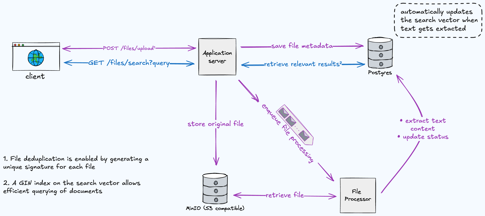

# [PoC] File Search Application

This project is a web application that allow users to upload files and perform full-text search within the file collection.

The main design goal is to provide a lighweight and extensible solution that is easy to setup and run.

## Demo

https://github.com/user-attachments/assets/309bff4a-7a4f-4333-abdb-3e12af26c083

## Tech Stack

- **Frontend**: React
- **Backend**: NestJS
- **Database**: PostgreSQL
- **Storage**: [MinIO](https://www.min.io/) (Free, S3 Compatible)
- **Queue**: [BullMQ](https://docs.bullmq.io/)
- **Infrastructure**: Docker

## Functional Requirements

- Upload files (up to 100MB). Supported file types:
  - Documents: `.txt`, `.pdf`, `.doc`, `.docx`, `.xls`, `.xlsx`, `.csv`.
  - Images: `.png`, `.jpg`, `.jpeg`, `.gif`, `.tiff`.
- List all uploaded files.
- Download existing files.
- Delete exisiting files.
- Reject the upload of files that already exist in the storage.
- Search through all files and find relevant content quickly.

## High-level Design



### Implementation Details

- Files are stored into a MinIO bucket.
- A job is enqueued to extract and store the file's text content into a Postgres' [`tsvector`](https://www.postgresql.org/docs/current/datatype-textsearch.html#DATATYPE-TSVECTOR) column (GIN-indexed).
- Full-text search is performed by combining and ranking the query results over the search vectors.

**Note**: Redis is used as a dependency of BullMQ. Caching strategies could be implemented, but it's out of scope.

This is a simple yet powerful approach, without requiring additional infrastructure like cloud storage or specialized search engines like Elasticsearch.

## Getting Started

### Prerequisites

- Docker and Docker Compose
- Node.js 18+ (for local development)

### Quick Start

1. Clone the application

2. Rename the `.env.example` file to `.env` (or create a separate `.env` file)

3. Build and start the application

```bash
docker-compose up --build
```

4. Access the application:

- Frontend: http://localhost:3000
- Backend API: http://localhost:3001
- MinIO Console: http://localhost:9001 (minioadmin/minioadmin123)

### Development

To run individual services for development:

1. Start dependencies:

```bash
docker-compose up postgres minio redis
```

2. Run backend:

```bash
cd backend
npm install
npm run start:dev
```

3. Run frontend:

```bash
cd frontend
npm install
npm start
```
